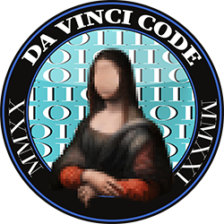

# Crypto101 Express 🚂🗝

Cours de cryptographie proposé par DaVinciCode, le club cybersécurité de l'[École supérieure d'ingénieurs Léonard-de-Vinci](https://www.esilv.fr/). Il s'agit d'un condensé du livre [Crypto101](https://www.crypto101.io/), et nous utilisons le warzone [Cryptohack](https://www.cryptohack.org/) pour appliquer les connaissances.

## Liens vers les slides

- [Exclusive OR](https://github.com/louiswolfers/crypto101-express/raw/master/exclusive_or/exclusive_or.pdf)
- [Block ciphers](https://github.com/louiswolfers/crypto101-express/raw/master/block_ciphers/block_ciphers.pdf)
