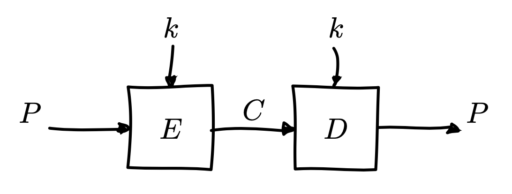
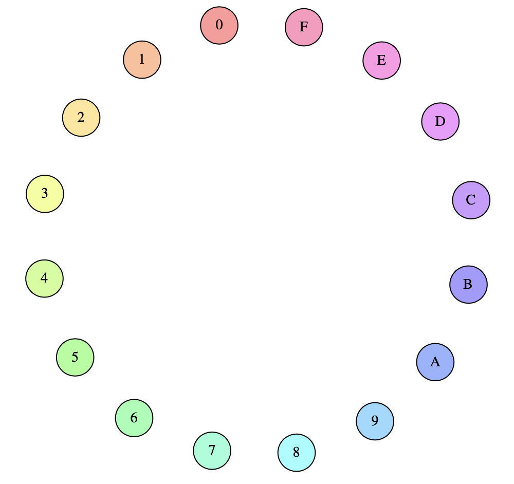
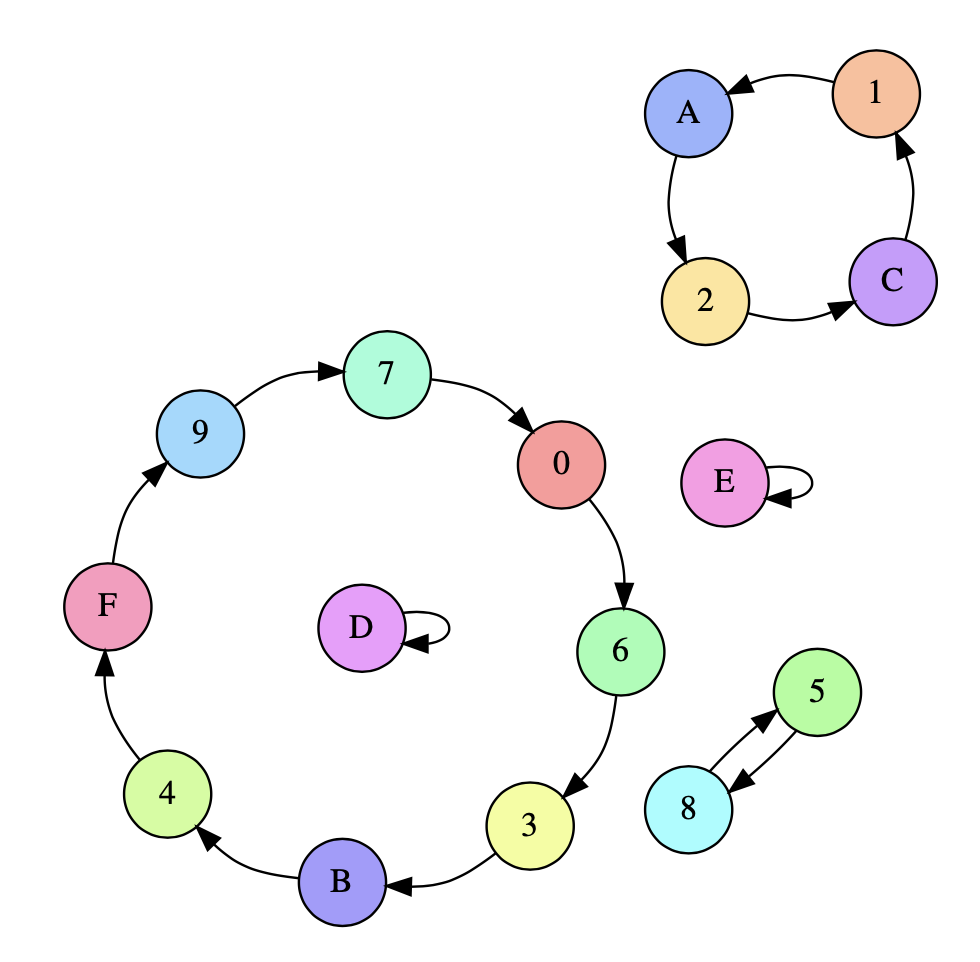
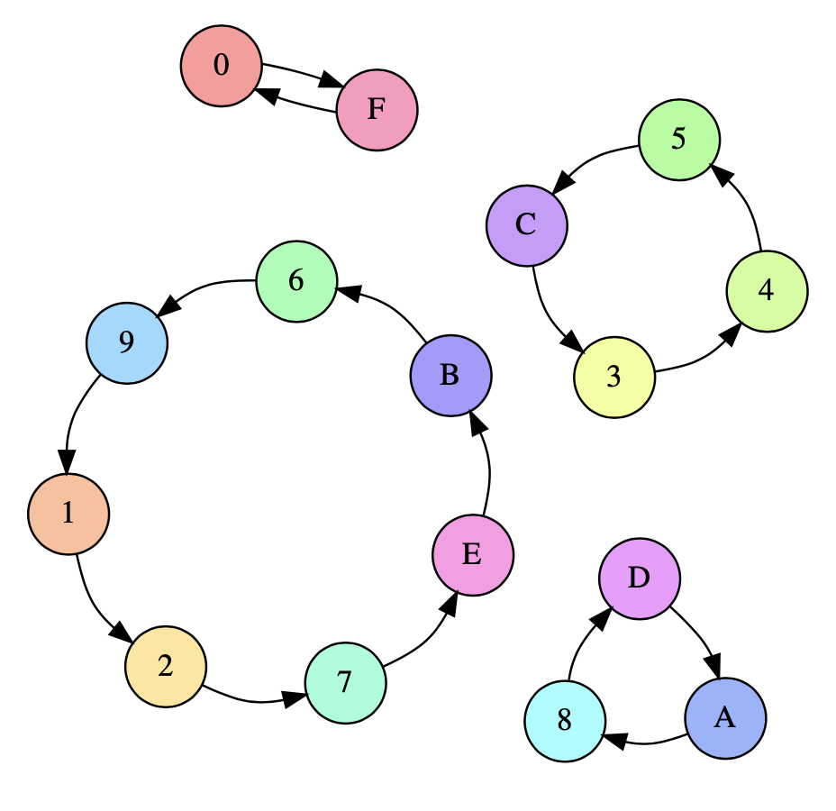
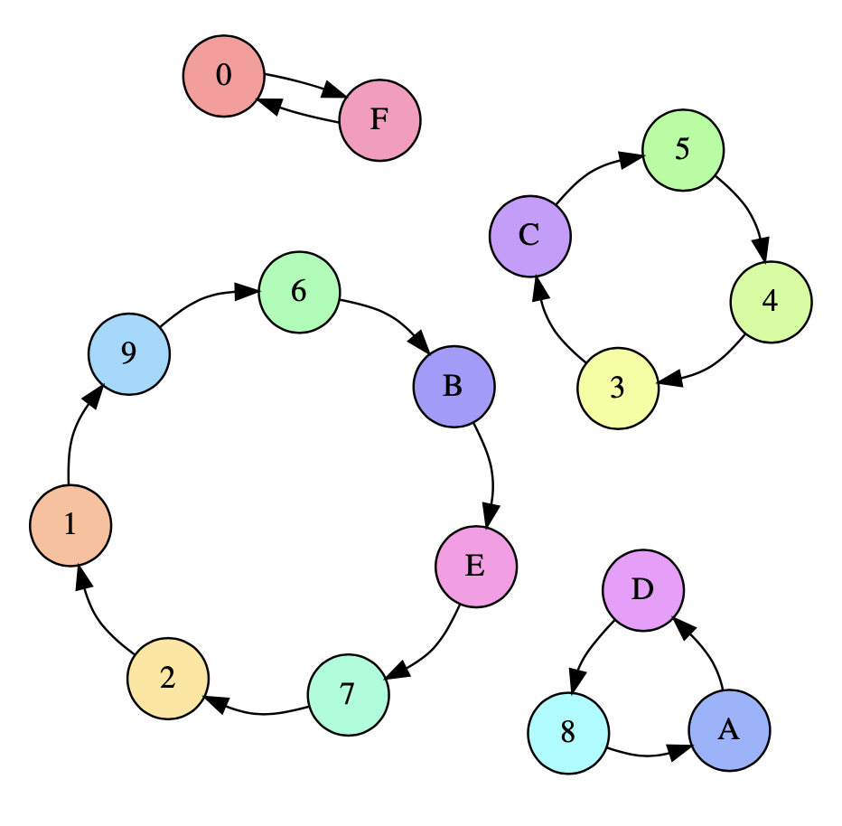

```{r setup, include=FALSE}
library(knitr)
if(Sys.info()["sysname"] == "Darwin") {
	opts_chunk$set(engine.path = "/usr/local/bin/python3")
} else {
	opts_chunk$set(engine.path = system("which python3"))
}
```

# Rappel

- OTP pas pratiques
  - taille des données = taille de la clef
  - problème de transmission des clés

# Rappel

- OTP pas pratiques
  - **taille des données = taille de la clef**
  - problème de transmission des clés

# Chiffrement par bloc

## Définition

Algorithmes qui permettent de chiffrer/déchiffrer des blocs de taille fixe (_e.g._ 16 bytes)
$$C = E(k, P)$$
$$P = D(k, C)$$

# Graphique

```{r, echo=FALSE, fig.align='center', out.width = "100%"}

```

## Remarque

Les algorithmes de chiffrement par bloc font partie de la cryptographie symmétrique du fait que la même clef est utilisée pour le chiffrement et le déchiffrement

# Comment ça fonctionne?

- imaginons que l'on veuille chiffrer un bloc de 4 bits
  - peut être représenté en hexa
    - $0000_{2} = 0_{16}$
    - $0001_{2} = 1_{16}$
    - ...
    - $1010_{2} = a_{16}$
    - $1011_{2} = b_{16}$
    - ...
    - $1111_{2} = f_{16}$

- une clef $\Rightarrow$ un ensemble de permutations

# Comment ça fonctionne?

```{r, echo=FALSE, fig.align='center', out.width = "50%"}

```

# Comment ça fonctionne?

- Chiffrement avec $k_1$

```{r, echo=FALSE, fig.align='center', out.width = "50%"}

```

# Comment ça fonctionne?

- Chiffrement avec $k_2$

```{r, echo=FALSE, fig.align='center', out.width = "50%"}

```

# Comment ça fonctionne?

- Déchiffrement avec $k_2$

```{r, echo=FALSE, fig.align='center', out.width = "50%"}

```

# [DES](https://en.wikipedia.org/wiki/Data_Encryption_Standard)

- [Data Encryption Standard](https://en.wikipedia.org/wiki/Data_Encryption_Standard), standardisé en 1977
- taille d'un bloc: 64 bits
- taille d'une clef: 64 bits
- taille effective d'une clef: 56 bits (8 bits de parité)
- bruteforcable en un jour (il semblerait)

```{python}
2**56
```

# [DES sur Python](https://pycryptodome.readthedocs.io/en/latest/src/cipher/des.html)

```{python}
from Crypto.Cipher import DES

key = b'13371337'
cipher = DES.new(key, DES.MODE_ECB)
ciphertext = cipher.encrypt(b'deadbeef')
plaintext = cipher.decrypt(ciphertext)
print(ciphertext)
print(plaintext)
```

# [3DES](https://en.wikipedia.org/wiki/Triple_DES)

$$C = E_{DES}(k_{1}, D_{DES}(k_{2}, E_{DES}(k_{3}, P)))$$
$$P = D_{DES}(k_{3}, E_{DES}(k_{2}, D_{DES}(k_{1}, C)))$$

- tentative d'étendre la vie de l'algorithme DES
- si $k_{1} \neq k_{2} \neq k_{3} \Rightarrow 168$ bits
- si $k_{1} = k_{3} \Rightarrow 112$ bits
- si $k_{1} = k_{2} = k_{3} \Rightarrow$ DES
- ça reste un mauvais choix

```{python}
2**168
2**112
```

# [3DES sur Python](https://pycryptodome.readthedocs.io/en/latest/src/cipher/des3.html)

```{python}
from Crypto.Cipher import DES3

key = b'13371337deadbeefbaddcafe'
# key = key1||key2||key3 ou key1||key2
cipher = DES3.new(key, DES3.MODE_ECB)
ciphertext = cipher.encrypt(b'universe')
plaintext = cipher.decrypt(ciphertext)
print(ciphertext)
print(plaintext)
```

# Pourquoi pas 2DES?

- vulnérable aux attaques [meet-in-the-middle](https://en.wikipedia.org/wiki/Meet-in-the-middle_attack)
$$C = \mathit{ENC}_{k_{2}}(\mathit{ENC}_{k_{1}}(P))$$
$$P = \mathit{DEC}_{k_{1}}(\mathit{DEC}_{k_{2}}(C))$$

$$C = \mathit{ENC}_{k_2}(\mathit{ENC}_{k_1}(P))$$
$$\iff \mathit{DEC}_{k_2}(C) = \mathit{DEC}_{k_2}(\mathit{ENC}_{k_2}[\mathit{ENC}_{k_1}(P)])$$
$$\iff \mathit{DEC}_{k_2}(C) = \mathit{ENC}_{k_1}(P)$$

- la sécurité du 2DES n'est que faiblement supérieure à celle du DES ($2^{57}$ _vs_ $2^{56}$)

# [AES](https://en.wikipedia.org/wiki/Advanced_Encryption_Standard)

- Advanced Encryption Standard (ou Rijndael)
- standardisé en 2002
- taille d'un bloc: 128 bits
- taille d'une clé: 128, 192, ou 256 bits

# Pour aller plus loin

- [https://cryptohack.org/challenges/aes/](https://cryptohack.org/challenges/aes/)
- Implémentation simplissime de l'algorithme AES en Python

# Toujours des inconvenients

- comment faire pour chiffrer un message de longueur indeterminée ?
- problème de transmission des clés

```{r, echo=FALSE, fig.align='center', out.width = "50%"}

```

# Des questions?

```
 $$$$\   $$$$\   $$$$\   $$$$\   $$$$\   $$$$\   $$$$\
$$  $$\ $$  $$\ $$  $$\ $$  $$\ $$  $$\ $$  $$\ $$  $$\
\__/$$ |\__/$$ |\__/$$ |\__/$$ |\__/$$ |\__/$$ |\__/$$ |
   $$  |   $$  |   $$  |   $$  |   $$  |   $$  |   $$  |
  $$  /   $$  /   $$  /   $$  /   $$  /   $$  /   $$  /
  \__/    \__/    \__/    \__/    \__/    \__/    \__/
  $$\     $$\     $$\     $$\     $$\     $$\     $$\
  \__|    \__|    \__|    \__|    \__|    \__|    \__|
```
