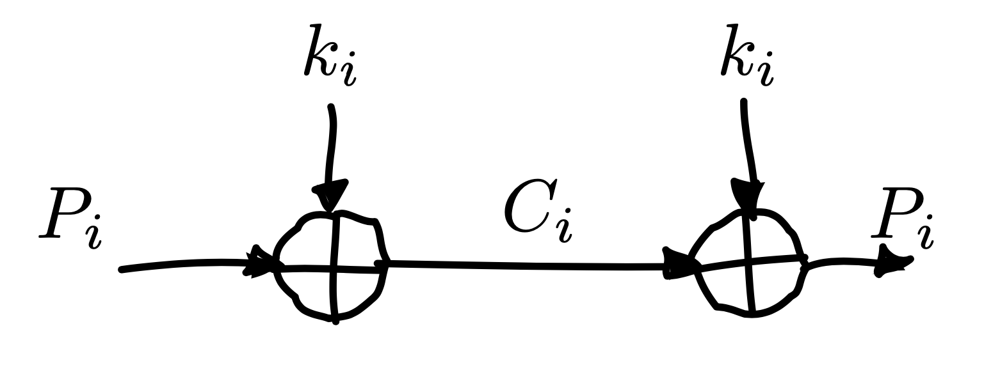
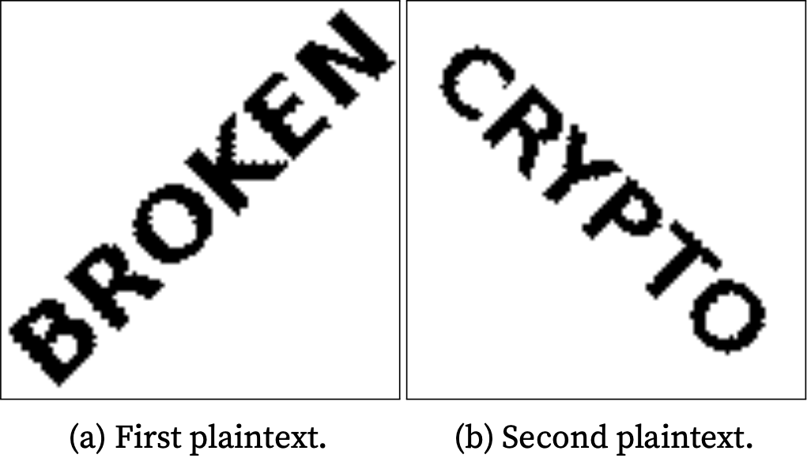
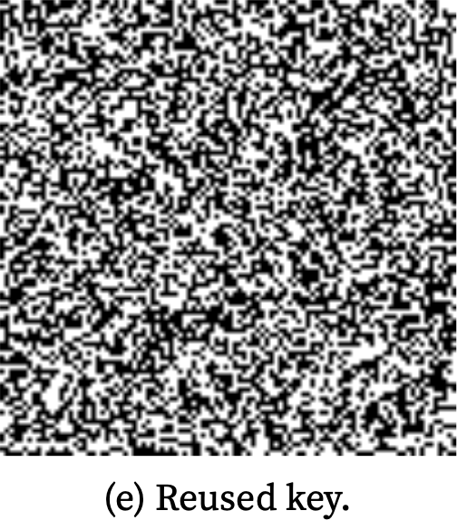
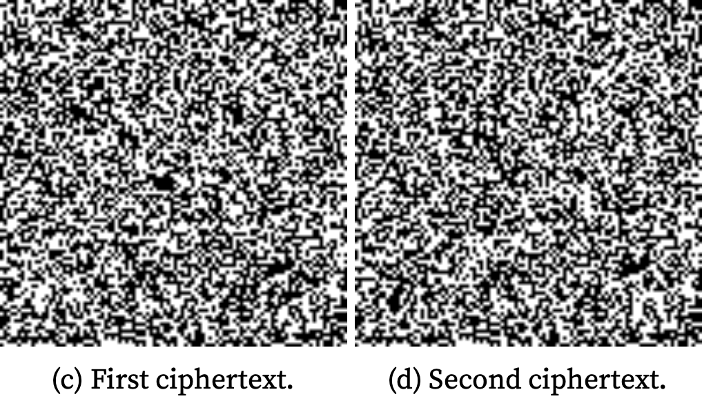
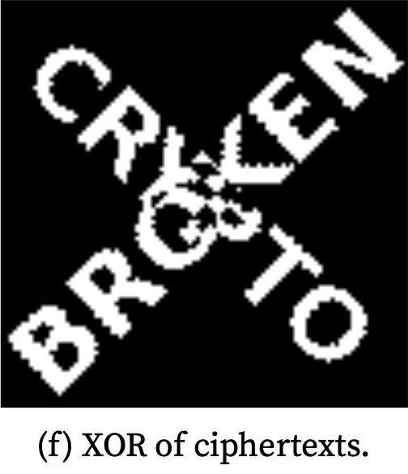

```{r setup, include=FALSE}
library(knitr)
opts_chunk$set(engine.path = "/usr/local/bin/python3")
```

# `whoami`

```{r, echo=FALSE, fig.align='center', out.width = "50%"}
include_graphics("images/esilv.png")
```

- Louis
- A4 (majeure objets connectés et cybersécurité)
- {height=1em} vim, {height=1em} Python

# Fonctionnement

- livre Crypto101 ([crypto101.io](https://crypto101.io/))
- challenges Cryptohack ([cryptohack.org](https://cryptohack.org/))

# Binaire

- Tout nombre peut être écrit comme la somme de puissances de 2
- Par exemple, 27 s’écrit

| $1$   | $1$   | $0$   | $1$   | $1$   |
|:-----:|:-----:|:-----:|:-----:|:-----:|
| $2^4$ | $2^3$ | $2^2$ | $2^1$ | $2^0$ |
| $16$  | $8$   | $0$   | $2$   | $1$   |

```{python}
0b11011
bin(27)
```

# Octet et hexa

- base 16 (0, ..., 9, a, ..., f)
- $16$ chiffres
- si on veut représenter 1 octet en hexa: $2^8=256$ il nous faut deux chiffres ($16 \times 16=256$)
- (_un chiffre en base 16 représente 4 bits_)

```{python}
bytes.fromhex('deadbeef') == b'\xde\xad\xbe\xef'
```

# ASCII

- acronyme pour American Standard Code for Information Interchange
- codage de caractères: chaque caractère peut être représenté par un nombre

```{python}
[chr(i) for i in range(65, 75)]
```

# Objectif de la cryptographie

- tout peut être représenté comme un nombre
- Alice veut envoyer un nombre à Bob de manière secrète
- on cherche à créer un modèle mathématique

# OU exclusif (XOR)

- opérateur noté $\oplus$

| A   | B   | $A \oplus B$ |
|:---:|:---:|:---:|
| $0$ | $0$ | $0$ |
| $0$ | $1$ | $1$ |
| $1$ | $0$ | $1$ |
| $1$ | $1$ | $0$ |

- pour les mots binaires, on fait l'opération bit par bit: $1100_2 \oplus 0101_2 = 1001_2$

```{python}
bin(0b1100 ^ 0b0101)
```
# Quelques propriétés du XOR

- $A \oplus A = 0$
- $A \oplus 0 = A$
- $A \oplus 1 = \overline{A}$ ($\overline{1001_2}=0110_2$)
- $A \oplus B = B \oplus A$ (commutativité)
- $A \oplus (B \oplus C) = (A \oplus B) \oplus C$ (associativité)
- $B \oplus A \oplus B = A \oplus (B \oplus B) = A$

# One Time Pad

- en français masque jetable (mdr)
- très simple: $\text{message} \oplus \text{clé}$
- offre une sécurité théorique absolue (prouvé par Claude Shannon en 1949)

```{r, echo=FALSE, fig.align='center', out.width = "50%"}

```

# Limitations

- la clef doit être vraiment aléatoire (sinon, $k_i$ peut être prédit)
- la clef ne doit pas être réutilisée
$$c_1 \oplus c_2 = (p_1 \oplus k) \oplus (p_2 \oplus k)$$
$$c_1 \oplus c_2 = p_1 \oplus p_2$$

# Démo

- on souhaite envoyer deux images

```{r, echo=FALSE, fig.align='center', out.height = "50%"}

```

# Démo

- avec la même clef

```{r, echo=FALSE, fig.align='center', out.height = "50%"}

```

# Démo

- on envoie alors $P_i \oplus k = C_i$

```{r, echo=FALSE, fig.align='center', out.height = "50%"}

```

# Démo

```{r, echo=FALSE, fig.align='center', out.height = "50%"}

```

# The end?

# The end?

- Peu pratique
    - 50 GB^[GB: gigabytes ou gigaoctets ($10^9$ octets) à ne pas confondre avec Gb (gigabits)] de données $\Rightarrow$ 50 GB de clef
    - Problème de distribution des clés

# Application

- [https://cryptohack.org/challenges/misc/](https://cryptohack.org/challenges/misc/)
- Challenge "Gotta go fast"
- Objectif: trouver une chaine de caractères de la forme `crypto{...}` (_flag_)

# Analyse du code source

# Analyse du code source

- la clef n'est pas réutilisée {height=1em}

# Analyse du code source

- la clef n'est pas réutilisée {height=1em}
- la clef n'est pas aléatoire {height=1em}
  - $k=\text{sha256}(\text{t})$ (avec $t$ le nombre de secondes passées depuis le 1er janvier 1970)

# Analyse du code source

- deux options:
  - `{"option": "get_flag"}` retourne le flag masqué
  - `{"option": "encrypt_data"}` retourne le message donné en paramètres masqué
