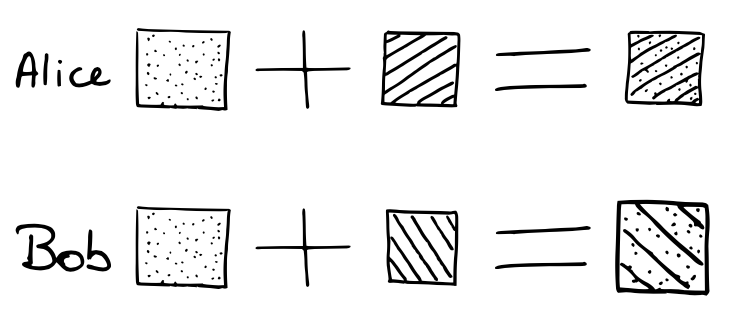

```{r setup, include=FALSE}
library(knitr)
if(Sys.info()["sysname"] == "Darwin") {
	opts_chunk$set(engine.path = "/usr/local/bin/python3")
} else {
	opts_chunk$set(engine.path = system("which python3"))
}
```

# Rappel

- chiffrer un message de taille aléatoire efficacement {height=1em}
- problème de transmission des clés {height=1em}

# Ce que l'on cherche à faire

- Alice et Bob
  - veulent se mettre d'accord et trouver un secret commun (une clef par exemple)
  - ils communiquent via un canal qui n'est pas sécurisé (n'importe qui peut voir les messages qu'ils s'échangent)

# Protocole Diffie-Hellman

- Whitfield Diffie et Martin Hellman
- se base sur le fait que certains problèmes mathématiques sont faciles à résoudre dans un sens, mais pas dans l'autre

# Protocole Diffie-Hellman

- analogie avec des pots de couleurs
- mélanger deux couleurs est facile, mais l'opération inverse est très compliquée
- nous allons suivre la suite de messages échangés par Alice et Bob
  - Eve a accès à tout ces messages

# Protocole Diffie-Hellman

- Alice et Bob se mettent d'accord sur une couleur de base

```{r, echo=FALSE, fig.align='center', out.width = "35%"}

```

# Protocole Diffie-Hellman 

- Alice et Bob choissisent tous les deux une couleur aléatoirement, et la mélangent avec la couleur de base

```{r, echo=FALSE, fig.align='center', out.width = "50%"}

```

# Protocole Diffie-Hellman 

- Alice et Bob s'échangent les mélanges qu'ils ont fait

```{r, echo=FALSE, fig.align='center', out.width = "50%"}

```

# Protocole Diffie-Hellman

- Alice mélange la couleur que Bob lui a envoyé avec sa couleur secrète 
- Bob mélange la couleur qu'Alice lui a envoyé avec sa couleur secrète 

```{r, echo=FALSE, fig.align='center', out.width = "50%"}

```

# Protocole Diffie-Hellman

- Problème du logarithme discret: $y \equiv g^{x} \pmod p$
  - calculer $x$ sachant $y, g, p$ est très compliqué
- $(g, p)$: couleur de base
- $x$: couleur secrète
- $y$: couleur de base mélangée avec leur couleur secrète

# Protocole Diffie-Hellman

- Quand Bob et Alice choisissent leur nombre secret:
  - Alice envoie à Bob $m_{A} \equiv g^{r_{A}} \pmod p$
  - Bob envoie à Alice $m_{B} \equiv g^{r_{B}} \pmod p$
- Ils calculent ensuite:
  - $s \equiv (g^{r_{A}})^{r_{B}} \pmod p$ (Alice)
  - $s \equiv (g^{r_{B}})^{r_{A}} \pmod p$ (Bob)
- Eve, n'ayant que $\{g^{r_{A}}, g^{r_{B}}, g, p\}$ ne peut pas calculer $s$.

# ProblemzZzZzZZz

- ils communiquent via un canal qui n'est pas sécurisé
  - n'importe qui peut voir les messages qu'ils s'échangent

# ProblemzZzZzZZz

- ils communiquent via un canal qui n'est pas sécurisé
  - n'importe qui peut voir les messages qu'ils s'échangent
  - n'importe qui peut faire semblant d'être Alice ou Bob (man-in-the-middle attack)

# ProblemzZzZzZZz

- Alice $\equiv$ Mallory $\equiv$ Bob
  - Mallory fait deux communications
    - Une avec Alice en se faisant passer par Bob
    - Une avec Bob en se faisant passer par Alice

# ProblemzZzZzZZz 

- Public-key encryption
