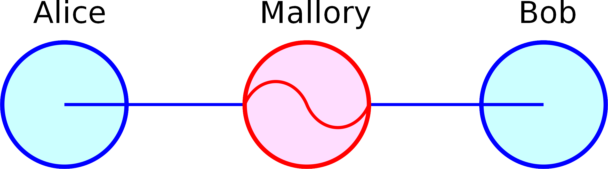

# Attaques si $IV = k$

```{r, echo=FALSE, fig.align='center', out.width = "75%"}

```
- [man-in-the-middle attack](https://en.wikipedia.org/wiki/Man-in-the-middle_attack)
- Alice veut envoyer $C=C_{1}C_{2}C_{3}$ à Bob
- Mallory intercepte le message et le modifie: $C'=C_{1}ZC_{1}$, avec $Z$ un bloc rempli de bytes nuls

# Attaques si $IV = k$

- Bob déchiffre le message d'Alice
$P_{1}'=D(k, C_{1}) \oplus IV$
$\iff P_{1}'=D(k, C_{1}) \oplus k$
$\iff P_{1}'=P_{1}$

$P_{2}'=D(k, C_{2}) \oplus C_{1}$
$\iff P_{2}'=R$

$P_{3}'=D(k, C_{1}) \oplus Z$
$P_{3}'=D(k, C_{1})$
$P_{3}'=P_{1} \oplus IV$

- Mallory a accès au déchiffrement de Bob

Bcp de théories
