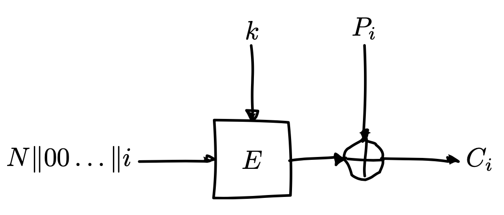

```{r setup, include=FALSE}
library(knitr)
if(Sys.info()["sysname"] == "Darwin") {
	opts_chunk$set(engine.path = "/usr/local/bin/python3")
} else {
	opts_chunk$set(engine.path = system("which python3"))
}
```

# Rappel

- Chiffrement par bloc
  - comment faire pour chiffrer un message de longueur indéterminée?
  - problème de transmission des clés

# Rappel

- Chiffrement par bloc
  - **comment faire pour chiffrer un message de longueur indéterminée?**
  - problème de transmission des clés

# Avec le chiffrement par blocs

- diviser le message par blocs et les chiffrer indépendamment

```{r, echo=FALSE, fig.align='center', out.width = "50%"}
include_graphics("images/ecb_mode.png")
```

- on appelle ce mode d'opération le mode ECB (Electronic codebook)
- $$C_{i} = E_{k}(P_{i})$$

# Padding

- comment faire si on veut chiffrer un message si sa taille n'est pas un multiple de la taille du bloc?
  - on rajoute un padding (rembourrage)

# Padding

- rajouter des zeros (le message ne peut donc pas finir par un byte nul)
- PKCS#7: si il nous manque 5 bytes pour que la taille soit un multiple de la taille du bloc, on rajoute: `05 05 05 05 05`
  - si on veut vraiment finir le message avec 5 bytes `05`, on rajoute un bloc entier de padding (`08 08 08 08 08 08 08 08`)

# Désavantages du mode ECB

- deux blocs identiques seront chiffrés de la même manière

```{r, echo=FALSE, fig.align='center', out.width = "50%"}
include_graphics("images/ecb_mode_weakness.png")
```

# Démo - Message

```{r, echo=FALSE, fig.align='center', out.width = "50%"}
include_graphics("images/tux.jpg")
```

# Démo - Chiffrement idéal

```{r, echo=FALSE, fig.align='center', out.width = "50%"}
include_graphics("images/tux_noise.jpg")
```

# Démo - Chiffrement avec ECB

```{r, echo=FALSE, fig.align='center', out.width = "50%"}
include_graphics("images/tux_ecb.jpg")
```

# CBC mode

- Cipher block chaining
- $C_{i} = E_{k}(P_{i} \oplus C_{i-1})$
- On XOR chaque bloc $P_i$ par le bloc chiffré $C_{i-1}$ précédent pour brouiller les motifs
  - deux blocs égaux ne seront pas chiffrés de la même manière

# Graphique - Chiffrement avec CBC

```{r, echo=FALSE, fig.align='center', out.width = "75%"}
include_graphics("images/cbc_encryption.png")
```

- $C_{0} = IV$ (initialization vector)

# Graphique - Déchiffrement avec CBC

```{r, echo=FALSE, fig.align='center', out.width = "75%"}
include_graphics("images/cbc_decryption.png")
```

- $P_{i} = D_{k}(C_{i}) \oplus C_{i-1}$

# Initialization vector

- il est envoyé avec le message chiffré
- il doit être imprévisible, **mais pas secret**
    - il ne doit surtout pas être égal à la clef

# Attaques si l'IV est prévisible

- imaginons le site d'une banque qui utilise le mode CBC pour chiffrer les données de ses clients
  - pour simplifier, 1 solde $\Rightarrow$ 1 bloc
  - on peut actualiser notre solde
- base de données:

| Client  | Solde                             |
|---------|-----------------------------------|
| Alice   | $C_{A}=E(k, IV_{A} \oplus P_{A})$ |
| Mallory | $C_{M}=E(k, IV_{M} \oplus P_{M})$ |
| Bob     | $C_{B}=E(k, IV_{B} \oplus P_{B})$ |

# Attaques si l'IV est prévisible

- Mallory est maline 
  - elle arrive à prédire les IV qui ont été utilisés pour chiffrer les données pour chaque client ($IV_{A}, IV_{M}, IV_{B}$)
  - elle a accès à la base de données chiffrées

1. elle actualise son solde $P_{M}=IV_{M} \oplus IV_{A} \oplus G$
2. la banque actualise la base de données:
$C_{M} = E(k, IV_{M} \oplus P_{M})$
$\iff C_{M} = E(k, IV_{M} \oplus (IV_{M} \oplus IV_{A} \oplus G))$
$\iff C_{M} = E(k, IV_{A} \oplus G)$
3. si $C_{M} = C_{A}$, alors Mallory a trouvé le solde d'Alice ($G$)

## Remarque
Cette banque aurait aussi du avoir une clé $k$ différente pour chaque client

# CTR mode

- **counter** mode
- nonce (number used once) à ne pas réutiliser
- $C_{i}=P_{i} \oplus E(k, N||00...||i)$

# CTR mode - Graphique

```{r, echo=FALSE, fig.align='center', out.width = "75%"}

```

# Salsa20

- **native** stream cipher
- état de l'art
- créé par Dan Bernstein
- ARX (add, rotate, XOR) design
  - $x\leftarrow x \oplus (y \boxplus z) \lll n$
  - modular addition: $\boxplus$
  - rotation: $\lll$

# Salsa20 sur Python (chiffrement)

```{python}
from Crypto.Cipher import Salsa20

plaintext = b'TOP_SECRET'
secret = b'\x13\x37'*16 # 32-byte key
cipher = Salsa20.new(key=secret)
msg = cipher.nonce + cipher.encrypt(plaintext)
print(msg[:8])
print(msg[8:])
```

# Salsa20 sur Python (déchiffrement)

```{python}
from Crypto.Cipher import Salsa20

secret = b'\x13\x37'*16
msg_nonce = b't\xe6\x0f\x142c\xe40'
ciphertext = b'\xe8\x8d\xfb\x9c\xce[@\xb5\x1aP'
cipher = Salsa20.new(key=secret, nonce=msg_nonce)
plaintext = cipher.decrypt(ciphertext)
print(plaintext)
```

# Toujours des problèmes >:(

- chiffrer n'importe quel message de manière sécurisée {height=1em}
- problème de transmission des clefs {height=1em}
